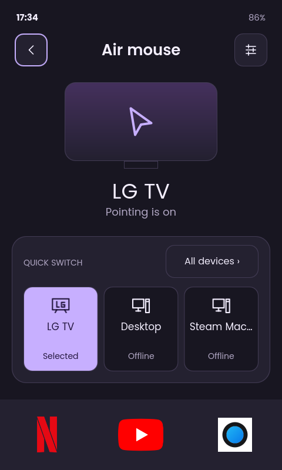
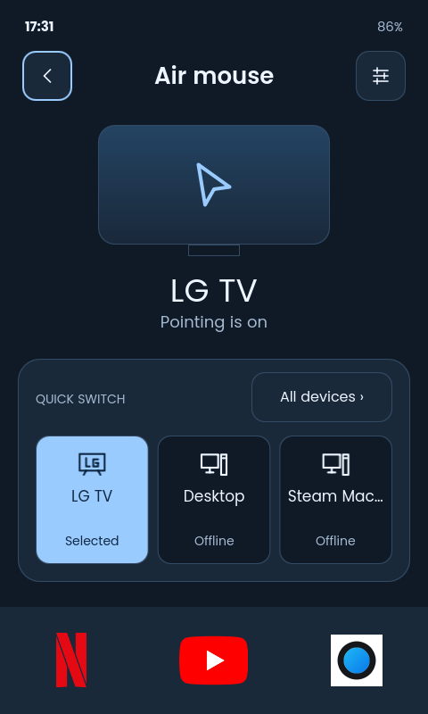
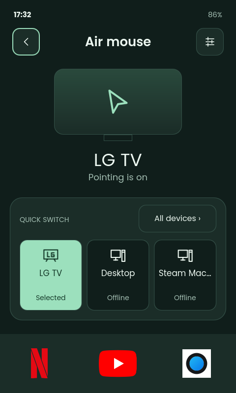
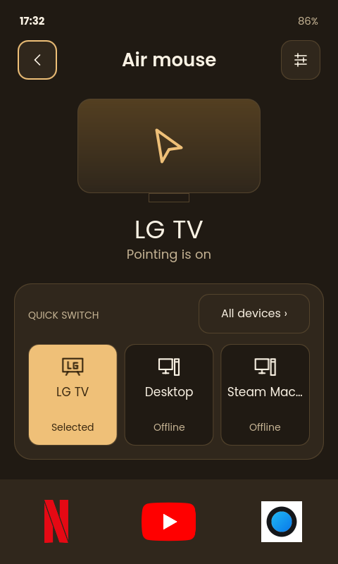
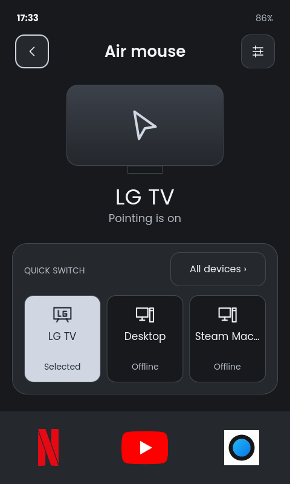
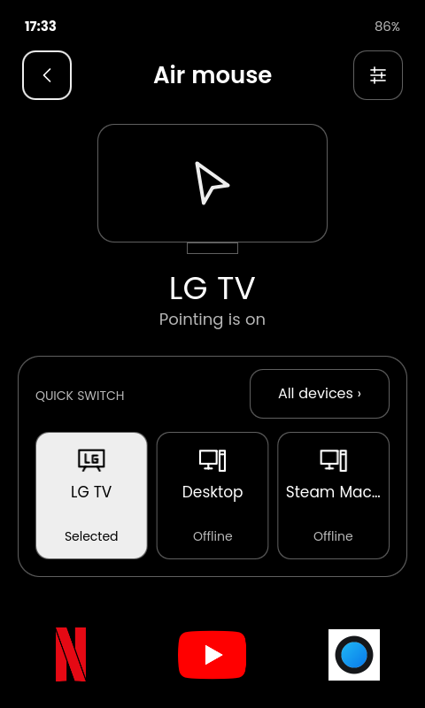
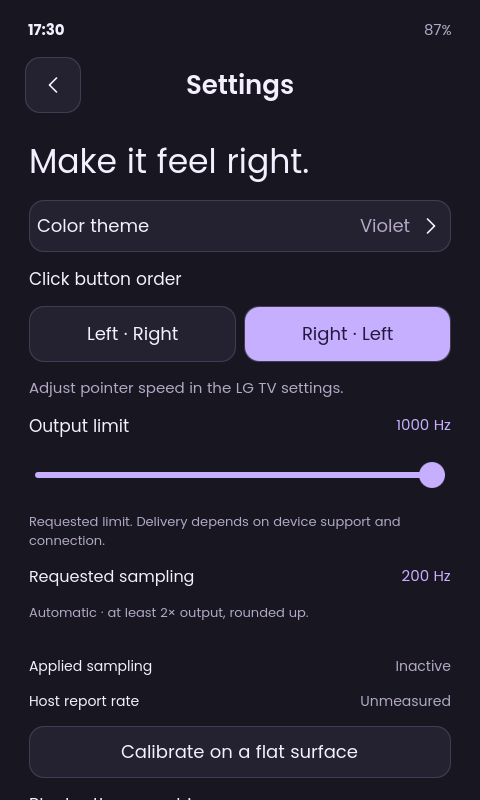
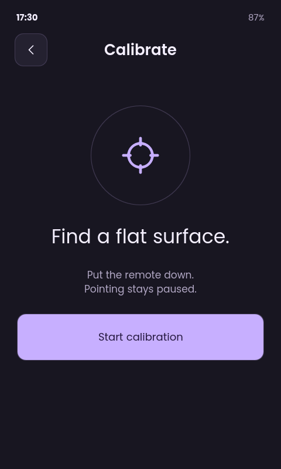

# Remote 3 air mouse

A native Qt Quick app and Node.js service turn the Remote 3's motion sensor into
a Bluetooth mouse. Computers use standard Bluetooth HID, with no companion app.

LG TV mode adds air-mouse pointing, TV controls, and Netflix, YouTube, and
Steam Machine shortcuts. The Steam Machine shortcut selects HDMI 1 and requests
power-on over HDMI-CEC. See the [LG TV guide](docs/lg-tv.md) for setup and limits.

## On the remote

TV mode in all six themes, captured directly from a Remote 3 running
`0.74.5-airmouse.31`:

| Violet | Glacier | Mint |
| --- | --- | --- |
|  |  |  |

| Amber | Graphite | True black |
| --- | --- | --- |
|  |  |  |

Settings exposes theme, click order, and output controls. The calibration screen
prompts you to place the remote on a flat surface before starting.

| Settings | Calibration |
| --- | --- |
|  |  |

These are unedited device screenshots. Capture another screen with
`tools/airmouse-screenshot --output /tmp/remote.png`.

## Use the air mouse

For a computer, open **Living room → Air mouse** and press Power to start
pointing. Slide the bottom strip right to scroll down or left to scroll up.

With the app's own Bluetooth backend in computer mode, OK holds the left
mouse button until you let go, including while moving or scrolling. Arrow keys
send keyboard directions. Settings can swap the on-screen click-button order. That
backend saves up to four computers and connects to one at a time. Open **All
devices → Edit** to rename computers, drag them into order, or forget a bond.
The first three are quick-switch buttons. A shortcut releases held buttons,
remembers whether pointing was on, and resumes it once the new computer
connects. A computer shows its Bluetooth name when it exposes one, and
**Computer N** otherwise.

The firmware backend sends complete clicks instead of holds, lists the first
three computers paired in the firmware settings, and leaves pointing off after a
switch.

Settings has controls for pointer speed, a 10 to 1000 Hz output limit,
calibration, six dark themes, and Bluetooth ownership. Leaving the mouse screen
pauses pointing. Closing the app, losing its connection, entering standby, or 60
seconds without motion stops output and restores the sensor settings. Display
sleep alone never closes the app and keeps an enabled pointer running.

The output limit sets the requested rate. The host report rate has not been
measured. The service selects the lowest sensor rate at least twice that limit
and reports when the installed driver cannot reach it. The lab firmware supports
sensor rates up to 800 Hz.

The owned Bluetooth backend takes control of the remote's Bluetooth controller
from the firmware service. Settings offers **Always**, **While open**, or
**Never**. With **Always**, the service takes control after every boot. You can
restore the firmware service with the rollback command.

- [Install and pair the owned Bluetooth backend](bluetooth/README.md)
- [LG TV Bluetooth controls and limitations](docs/lg-tv.md)
- [Bluetooth ownership and release behavior](docs/design/owned-bluetooth.md)
- [Build and install the native UI](native/README.md)
- [Operate and diagnose the service](docs/operations.md)
- [Native UI design and protocol](docs/design/native-ui.md)
- [Firmware mouse-button limitation](docs/design/mouse-button-protocol.md)
- [Experimental sensor drivers](drivers/README.md)

Run local checks and builds with:

```sh
npm test
npm run test:native
npm run build
npm run build:native
```

Check documentation links and code fences with `python3 tools/check-docs`.

The service lives in `runtime/`, native QML and its C++ bridge in `native/`, deployment in
`deploy/`, and repeatable commands in `tools/`. Normal deployment excludes the experimental
kernel modules.

## License

The default license is MIT, with three exceptions listed in [LICENSE](LICENSE).
Two native UI files and the UI build patches extend the Unfolded Circle Remote
UI, so they are GPL-3.0-or-later. The experimental kernel drivers are GPL-2.0.
The Bluetooth daemon links against BTstack, whose license allows personal,
noncommercial use only.

Installing this replaces the remote's Bluetooth service, adds system units, and
activates the vendor's custom UI installer, which records a warranty consent
that cannot be undone. Read the [operations guide](docs/operations.md) and the
[native UI guide](native/README.md) first.
