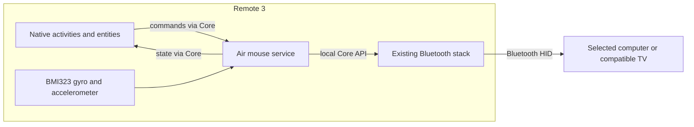

# Remote 3 air mouse design

This proposal records the design on 2026-09-07, based on firmware 2.10.2. It
includes features later replaced or removed. For implementation results and the
rejected gyro-range setting, see [verification results](../verification.md). For
the current app, see the [README](../../README.md).

The user accepted these changes after the proposal:

- ±2000°/s replaces the original ±500°/s range after firmware rejected scale writes.
- The Pointer sampling rate selector is replaced by automatic rate selection. The UI sets a
  10 to 1000 Hz output limit; the service requests the lowest supported sensor rate at
  least twice that limit on each activation and reports when the driver cannot
  meet it. Rate changes while pointing are refused rather than reconfigured live.
- Quick-switch resume requests expire after three seconds.
- The Living room launcher is a single button entity from a local launcher
  integration, so Core can place it on a page. It carries no pointer control.
- The Core backend refuses a second target switch after any output until host
  isolation is verified by hand; the owned BTstack backend switches freely.
- The startup permission helper lives in `runtime/permissions.mjs`, so the
  installed service depends only on `runtime/` and its unit file.

## Proposed controls

Add an Air mouse integration and use its native entities in normal Remote 3
activities. Save Desktop, Laptop, and Steam machine as targets. A later LG
target uses the same motion engine. The remote handles all processing and stores
settings, credentials, and target selection. Computers use their Bluetooth HID
support, with no companion application required by the design.

The user requested Windows, Linux, and webOS support, with a pointer toggle:

| Control | Behavior |
| --- | --- |
| Target | Select one saved device. Show Connecting, Ready, or Unavailable. |
| Pointer switch | Explicit on/off state. Movement starts only for a ready target. |
| Pointer button | Short press toggles. Long press turns off. Verify repeat behavior on installed firmware. |
| OK | Left click while using the air mouse controls. |
| Right click | Dedicated screen button. Keep Back available for native navigation. |
| Scroll up/down | Native buttons initially. Consider the side slider after proving its event access. |
| Sensitivity | Per-target Slow, Normal, and Fast presets, with tuning through integration setup. |
| Pointer sampling rate | Native selector for 50, 100, 200, 400, or 800 Hz, filtered to rates supported by both sensors. Default 400 Hz. |
| Calibrate | Stop motion and estimate gyro bias while the remote is still. Report failure if it moves. |

Expose a native switch for pointer state, select entities for the active target
and pointer sampling rate, and a remote entity for click, scroll, calibration,
and button mappings. The main remote page provides actions. Use supported native
entity attributes for state. Check the page layout on the device before relying
on it.

Selecting a different target turns the pointer off. Once the new target is ready, you toggle it on. Restart, reconnect, and wake also leave it off. Save the preferred target and tuning, but never save pointer-on state or pending input.

Native activity start can select its target. Activity shutdown sends an explicit
pointer-off command. Leaving a page does not necessarily stop the activity. An
idle timeout provides a configurable fallback; choose its duration after hand
testing. Avoid globally disabling sleep to keep the pointer running.

## Service architecture

Use one on-device service with narrowly granted sensor access. It implements the Integration API so Core renders standard entities and activities. It calls Core's existing Bluetooth entities for output. Core continues to own pairing, bonds, radio access, and its Bluetooth service.



Installation requires root to create the service and grant permissions. The
runtime should use a dedicated user with access only to the required device and
sensor attributes. This permission model still needs validation. Do not change
the global integration sandbox or run a competing Bluetooth stack.

The Integration API endpoint binds locally. Register it with Core through the
supported driver registration flow and validate loopback access. The hardware
service can support native UI without using the ordinary custom-driver archive.
Do not assume a Web Config driver upload grants sensor permissions.

Provision a persistent Core API key through normal authenticated setup and
verify it is active. Store it on the remote with restricted permissions. The key
is independent of the Web Config PIN and development machine. The Core
documentation reviewed for this proposal lists only the admin scope. Remote API
access, SSH, and the PIN provider are deployment concerns, not dependencies in
the motion loop.

## Caller contract

The native UI adapter submits controller commands. This type sketch describes
the proposed interface. It is not executable code or an SDK reference:

```text
controller.apply(SetPointer(On), requestIdentity)
controller.apply(SelectTarget(laptopId), requestIdentity)
controller.apply(SetSamplingFrequency(200), requestIdentity)
controller.apply(Click(Left), requestIdentity)
nativeEntities.publish(controller.snapshot())

Target = { id, name, outputBinding, motionTuning }
OutputBinding = CoreBluetooth(entityId) | FutureLg(binding)
State = Unselected | Connecting(target) | Offline(target, reason)
      | Ready(endpoint) | Pointing(endpoint, session) | Fault(reason)
Session = { generation, filter, fractionalRemainder, lastSampleTime }
Sample = { generation, monotonicTime, angularVelocity, acceleration }
Action = Click(button) | Scroll(amount) | Move(dx, dy)
       | FutureSupportedTvCommand(command)

Controller.apply(command, requestIdentity) -> Status
Controller.accept(sample) -> void
Controller.snapshot() -> Status
MotionFilter.step(sample) -> optional PointerDelta
TargetOutput.open(binding) -> ConnectedEndpoint
ConnectedEndpoint.send(supportedAction) -> DeliveryResult
ConnectedEndpoint.quiesce() -> QuiescenceResult(endpoint, connectionGeneration)
```

Only the output implementation constructs a connected endpoint. Its capabilities
determine available actions. Unsupported drag or TV commands remain unavailable.
`quiesce` must report unresolved delivery. Cancelling a local task cannot cancel work
Core has already accepted.

Four modules own the implementation:

| Module | What it owns |
| --- | --- |
| controller | Saved targets, the sole runtime state machine, command ordering, session generations, and derived status. |
| motion | Sensor discovery, scale and scan-layout decoding, acquisition, calibration, and a pure filter that can replay recorded samples. |
| output | Core credentials, Bluetooth entity routing, report limits, pacing, delivery uncertainty, and future target-specific transports. |
| integration | Integration API messages, native entity definitions, setup, and command validation. |

The sensor task submits samples without changing the selected target. The
integration task submits commands without changing connection state. Prioritize
stop and target commands over motion. No generic plugin loader is needed at
first. Adding a backend means implementing output behavior and declaring
supported actions.

## Motion and switching

The proposal defined the future service configuration in
[config/airmouse.json](../../config/airmouse.json). No runtime loaded it at the
time. That file now contains the implemented configuration, so the original
fields described below may differ.

`motion.active_profile` selects the active sensor settings while pointing is enabled. Its shared `sampling_frequency_hz`
sets both sensor rates and is the single persisted value controlled by the UI.
Sampling rate is global to the remote. Switching targets does not change it. The
gyroscope's `range_degrees_per_second` is the magnitude of its symmetric range, so 500 means ±500°/s.
Unspecified sensor settings remain unchanged. These initial active values
require hardware and power validation before deployment.

`ui.sampling_frequency_options_hz` defines the candidate choices for a native select entity named Pointer
sampling rate. The integration intersects these choices with both sensors'
available rates and publishes labels such as `200 Hz`. It handles the documented
select commands, validates incoming choices against the current options, and
publishes `current_option` through `entity_change`. If no rate is supported, disable the selector and
prevent activation. If a saved rate becomes unsupported, require a new
selection. The selected option represents the configured active rate, not the
current idle hardware rate.

While inactive, selection only updates the configuration atomically on the
remote. It does not touch the sensor or capture a restoration baseline. While
active, the controller validates the choice, pauses motion output, invalidates
old samples, and reconfigures acquisition to the new rate. It verifies readback
and saves the selection before publishing success, then resumes with a fresh
filter and motion generation. A repeated selection of the current rate is a
no-op. Reject invalid choices without changing the session. If reconfiguration
fails, stop pointing and restore the original pre-activation settings. Keep the
last saved selection and report the error. Rate changes must never overwrite
that baseline. Off, standby, and target changes take precedence over
reconfiguration and prevent an obsolete request from resuming motion.

`motion.inactive_profile` is `restore_previous`. Before activation, the service snapshots the actual sensor settings
it will change. It restores those settings when pointing ends, rather than
hard-coding the observed 50 Hz as a permanent firmware default. Repeated
activation while already active must not replace the saved baseline with the
active settings.

Activation validates the requested profile against the device's supported settings, establishes sensor ownership, and saves a recovery record before making changes. It applies the profile, verifies readback, resets the motion filter, and only then permits pointer output. A partial configuration failure rolls back the changes and leaves pointing off. Unsupported settings produce a visible error instead of silently substituting another profile.

Deactivation stops acquisition and restores every setting changed for the session, including buffer, trigger, and scan settings if the acquisition method changes them. This applies to explicit off, idle timeout, activity shutdown, target changes, standby, disconnects, sensor faults, and normal service shutdown. The service must preserve firmware move-to-wake behavior and must not keep polling at the active rate while inactive.

Crash recovery requires an on-device service-manager cleanup hook and startup
recovery using the saved baseline. In-process cleanup alone cannot handle a
killed process. Recovery validates device identity and record compatibility
before writing. It must not overwrite a newer configuration from another owner.
Restoration failures remain visible and block a new pointing session until
resolved. Sleep and firmware-update interactions still need a device test.

Use gyroscope angular velocity to produce relative pointer movement. Use the
accelerometer for gravity orientation and stationary detection. Do not integrate
linear acceleration into screen position. Test physical axis direction by hand.
The identity mount matrix alone does not establish which movement should move
the cursor right.

Measure a baseline at the observed 50 Hz before testing the active profile. Read
scale, rate, channel layout, and timestamps at runtime. Sequential sysfs reads
establish access. They do not establish that readings come from the same sample.
Before enabling buffered acquisition or changing rates, establish who already
uses the sensor and preserve move-to-wake behavior. The probe found the IIO
buffer disabled and its timestamp channel disabled.

Keep gyro bias, smoothing, deadband, roll compensation, and fractional movement
in the motion session. Reset integration on sample gaps, non-monotonic time,
calibration changes, or session changes. Validate tuning against Windows and
Linux host pointer acceleration before adding an acceleration curve.

The output adapter converts movement to the documented signed-byte commands. It keeps a bounded amount of fresh movement, preserves fractional counts, and drops stale movement on congestion. Separate X/Y commands may affect diagonal smoothness. Do not build an unbounded queue to preserve every sample. A successful Core response is not a measurement of host cursor latency.

On pointer off, target change, standby, sensor failure, transport loss, or loss of the Core control connection:

1. Invalidate the current motion generation and reject further samples for it.
2. Discard local pending movement and stop new sends.
3. Stop acquisition and restore the saved sensor configuration. Do not wait for Bluetooth delivery to finish before releasing the sensor settings.
4. Resolve old in-flight output or mark delivery uncertain. Release held buttons if that capability is added and the old connection permits it.
5. Keep pointer state off. A target switch requires verified isolation from old output before the new endpoint can receive input.

A generation number protects only the service's queues. Tag derived deltas and
pending output batches as well as raw samples. It cannot retract commands
already accepted by Core. Quiescence evidence must identify the old endpoint and
connection generation. Validate entity-specific routing and draining. If the
transport cannot establish isolation, show a failed switch and revisit the
output design.

Use explicit ON/OFF for state commands. Convert a physical toggle once at the UI
boundary, serialize it, and suppress retransmission of the same identified
request. Handle repeated presses in the UI as well as duplicate request IDs. Do
not replay clicks or scroll actions automatically after ambiguous delivery.

## Multiple devices and LG

Saved devices, Bluetooth connections, and the selected output target are
separate concepts. The design supports one selected output. The user reports
that the firmware's multiple-connection preview setting is enabled. Verify
connection capacity and routing on this firmware. Fast switching among three
saved computers still needs testing. Prefer selecting among existing connections
when possible, while sending air mouse input only to the selected target. Do not
promise a switch time before testing.

The computer profile uses standard Bluetooth HID for Windows and Linux.
The [LG TV profile](../lg-tv.md) uses the observed MR23 Bluetooth LE identity,
GATT map, native key codes, motion reports, and control responses. The lab TV
identifies itself as OLED77G3PSA. Packet and lifecycle tests pass; fresh pairing
and pointer behavior still need validation on that TV. Profile changes happen
while disconnected, and existing TV connections require fresh pairing. Voice,
IR, and TV power-on are outside the implemented protocol. The profile uses
Bluetooth only.

## Why this design

The single-service candidate is the proposed base. It hides sensor timing, target selection, and output policy behind a small command interface. Root-assisted hardware-service installation is accepted, and a second process does not currently provide a required capability.

The split candidate puts acquisition and filtering in a separate service and keeps a standard sandboxed integration. It offers stronger process isolation but adds socket access through the sandbox, protocol compatibility, leases, and independent restart handling. Retain this option if standard archive installation or stronger process isolation becomes a requirement.

The single-service design adopts session IDs on samples, stationary calibration,
separate sensor permissions, and checks for supported output capabilities from
the split proposal. Keep these within the single process for now. Both
candidates require measured Core throughput and transport isolation. Neither
justifies replacing the firmware Bluetooth service before those checks.

An independent design review scored the unified proposal 29/30 and the split
proposal 26/30 against six criteria: on-device operation, native UI, hardware
evidence, switching isolation, LG extension, and interface size. Both lost a
point for unproven transport isolation. The unified proposal won on fewer
installation and runtime contracts. The review rejected pass-through service
layers. Protocol details stay inside their modules, and one module owns target
state.

Choose the language and packaging after a small aarch64 deployment test.

## First implementation checks

Build an on-remote motion recorder with a time limit and a replay tool. Then
test output to one selected paired computer through Core with a provisioned
credential. All production acquisition and output stay on Remote 3; a host-side
test recorder may measure received input during development.

Before implementing the full UI and controller, complete these checks:

- Record coherent samples and quantify rate, gaps, stationary noise, and physical axes without breaking normal remote wake and input.
- Measure horizontal and diagonal motion, click, wheel, saturation, Core response timing, and host-observed delay. Set a latency target after the baseline; report timing distributions.
- Confirm target switching never sends input to the wrong host and never replays old motion after reconnect.
- Confirm pointer-off on standby, control disconnect, process restart, and sensor loss. Wake requires a new toggle.
- Verify active-profile application and exact restoration of changed settings after off, repeated activation, partial activation failure, and service termination. Confirm inactive sampling overhead stops and measure whole-remote power in both states.
- Verify native toggle repeat behavior, activity shutdown mapping, and visible state on firmware 2.10.2.
- Verify the native rate selector filters unsupported options, persists across restart, makes no sensor writes while inactive, and resets motion safely during active changes. Check configuration failure and a concurrent off command preserve the original restoration baseline and leave no stale motion.
- Demonstrate operation with the development machine disconnected.

Hold and drag remain a separate test because documented Bluetooth hold
parameters are ignored.

## Evidence

- [Device observations](grounding.md) and [repeatable snapshot](device-snapshot.txt).
- [Native remote entity](https://unfoldedcircle.github.io/core-api/entities/entity_remote.html).
- [Native select entity](https://unfoldedcircle.github.io/core-api/entities/entity_select.html).
- [Bluetooth commands](https://unfoldedcircle.github.io/core-api/bt/index.html), [restrictions](https://unfoldedcircle.github.io/core-api/bt/TODO.html), and [sleep behavior](https://unfoldedcircle.github.io/core-api/bt/suspend_behaviour.html).
- [LG test report](https://unfoldedcircle.github.io/core-api/bt/devices/LG-WebOS.html) and [known Bluetooth issues](https://unfoldedcircle.github.io/core-api/bt/known_issues.html).
- [Driver installation](https://unfoldedcircle.github.io/core-api/integration-driver/driver-installation.html) and [Core authentication](https://github.com/unfoldedcircle/core-api/blob/main/core-api/README.md#authentication).
- [UI button handling at the reviewed revision](https://github.com/unfoldedcircle/remote-ui/blob/f3d34daea76239a92b5d43793f9eb849e5d0fc19/src/qml/components/ButtonNavigation.qml). Source inspection must still be checked against installed UI behavior.
